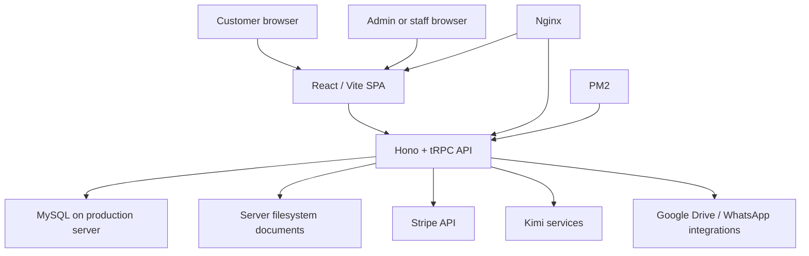
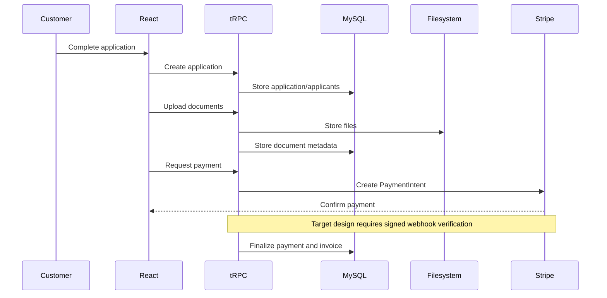

# Architecture

## System overview

TASHIRA is a single-repository full-stack application. The Vite-built React SPA communicates with a Hono server through tRPC. Drizzle ORM accesses MySQL. Production documents are intended to live on the production server filesystem at `/var/www/tashira/storage/documents`.

## Frontend

`src/main.tsx` mounts the application. `src/App.tsx` defines public, customer, admin, and staff routes. `src/sections/` contains the public application experience, `src/pages/admin/` contains internal views, `src/components/shared/` contains business components, and `src/providers/trpc.tsx` configures API access.

Client guards improve navigation but are not security boundaries. Authorization must be enforced by the API.

## Backend

`api/boot.ts` is the Hono entry point. It mounts OAuth, invoice, storage, health, static-file, and tRPC routes. `api/router.ts` composes domain routers for authentication, applications, payments, chat, wizard state, documents, storage, invoices, suppliers, staff, and Drive.

## Data layer

`db/schema.ts` describes MySQL tables through Drizzle ORM. Production uses MySQL hosted on the production server. Repository schema and migrations may differ from production and must be verified before change.

## Main flows

## User roles

- Customers submit, pay for, and track applications.
- Staff review assigned operational information.
- Administrators manage applications, documents, invoices, suppliers, VAT reporting, staff, and chat.

All PII and internal operations require server-side authorization.

## Document storage

The intended active architecture is server filesystem storage. Expected production path: `/var/www/tashira/storage/documents`. Supabase code is legacy/inactive unless runtime verification proves otherwise. Container use requires a persistent volume.

## Runtime and deployment

The intended runtime uses Nginx as reverse proxy and static host, with PM2 managing the Node API. The repository also contains GitHub Actions, webhook, cron, manual, and Docker Compose deployment mechanisms. These may conflict and should ultimately be consolidated.

See [DEPLOYMENT.md](DEPLOYMENT.md), [docs/STORAGE.md](docs/STORAGE.md), and [docs/API.md](docs/API.md).
