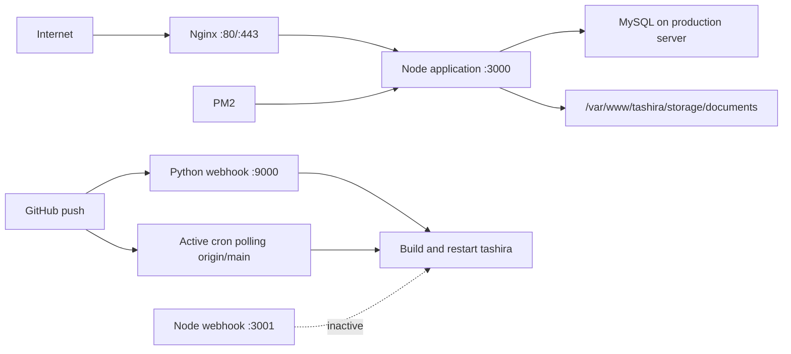
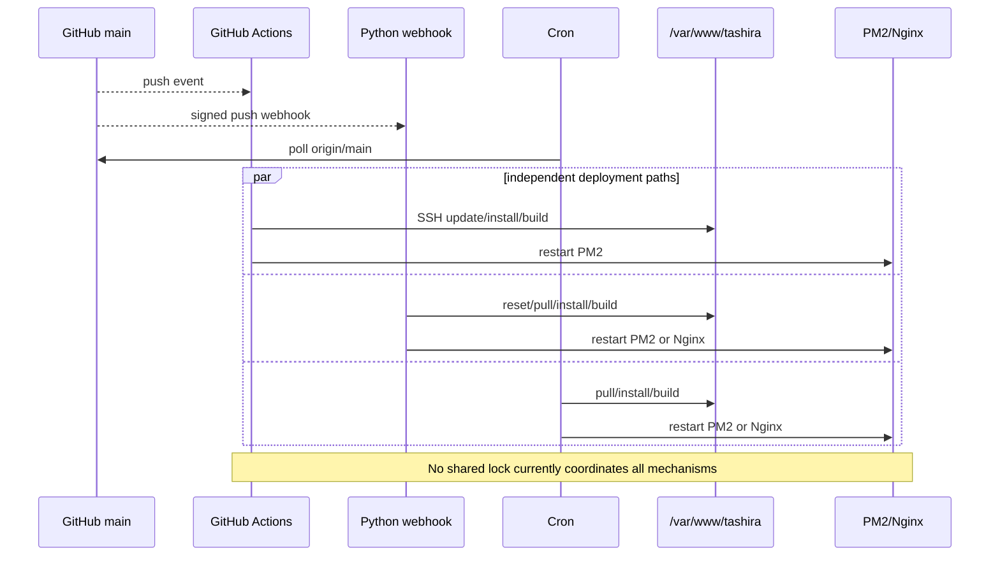

# TASHIRA Operations Runbook

## Purpose

This runbook documents the current and target operating model for TASHIRA. It is intended for read-only diagnosis, deployment planning, incident response, and controlled recovery.

Production access and every service-affecting, deployment-affecting, data-affecting, or destructive action require explicit approval. Repository files and comments are not proof of live production state; verify runtime facts before acting. Never expose secrets, environment values, customer PII, or document contents in commands, logs, screenshots, or reports.

For deployment architecture, current mechanism risks, and the proposed controlled pipeline, see [DEPLOYMENT.md](DEPLOYMENT.md).

## Current production topology

The following facts were verified through production inspection:

- Host platform: Ubuntu VPS.
- Application directory: `/var/www/tashira`.
- Application entry point: `/var/www/tashira/dist/boot.js`.
- Node application: PM2 process `tashira`, listening on port `3000`.
- Reverse proxy: Nginx, proxying application traffic to `localhost:3000`.
- Active webhook: Python service on port `9000`.
- Inactive webhook: repository Node webhook configured for port `3001`; no production listener exists.
- Database: MySQL hosted on the production server.
- Documents: server filesystem at `/var/www/tashira/storage/documents`.
- Docker: not installed in current production.
- Supabase: legacy/inactive unless future runtime verification proves otherwise.



## Current deployment mechanisms

### GitHub Actions

- Trigger: repository workflow defines pushes to `main` and `master`, plus manual dispatch.
- Files: `.github/workflows/deploy.yml`.
- Actions: checkout, SSH setup, production Git update, conditional `npm ci`, build, PM2 restart/start, and `pm2 save`.
- Current status: workflow exists and receives pushes; recent public runs were observed failing. Successful production execution is not verified.
- Risk: overlaps cron/webhook; no production approval gate or quality gates; deploys from the live checkout; dynamic `ssh-keyscan` is not pinned host verification.
- Production verification complete: partial. Workflow definition and public run metadata are verified; live effects and GitHub environment controls remain unverified.

### Python webhook

- Trigger: signed GitHub `push` event with `ref == refs/heads/main`.
- Files: `scripts/webhook-server.py`, `scripts/tashira-webhook.service`, `scripts/setup-vps-autodeploy.sh`.
- Actions: reset/clean production checkout, pull `main`, `npm install`, build, restart PM2, fall back to Nginx restart, and run a local health check.
- Current status: active on production port `9000`; recent webhook deployments were observed in sanitized logs.
- Risk: duplicates cron and Actions; runs with broad production access; public log endpoint and embedded fallback secret require remediation.
- Production verification complete: active service, listener, branch guard, and recent activity are verified. Exact GitHub webhook settings and supervisor identity still require confirmation.

### Cron deployment

- Trigger: periodic comparison of local revision with `origin/main`.
- Files: `scripts/cron-deploy.sh`, installed by `scripts/setup-vps-autodeploy.sh`.
- Actions: fetch/pull main, `npm install`, build, restart PM2 or fall back to Nginx, and health check.
- Current status: an active production cron deployment polling `origin/main` is verified.
- Risk: races webhook/Actions; uses a mechanism-specific lock; destructive checkout cleanup; non-deterministic `npm install`.
- Production verification complete: active main-only behavior is verified. Exact script, cron owner, schedule, and log destination require confirmation.

### Root cron updater

- Trigger: periodic comparison with `origin/main`.
- Files: `auto-update.sh`, `setup-auto-update.sh`.
- Actions: pull, `npm install`, build, and Nginx restart.
- Current status: repository mechanism exists. It is not confirmed whether this separate updater is installed in addition to the verified active cron.
- Risk: separate lock, no strict failure handling, restarts Nginx instead of PM2, and can overlap every other deployment path.
- Production verification complete: no.

### Manual scripts

- Trigger: explicit operator execution.
- Files: `manual-deploy.sh`, `scripts/manual-deploy.sh`, and root `vps-*.sh` scripts.
- Actions: inconsistent combinations of pull/reset, dependency installation, build, PM2/Nginx restart, destructive cleanup, and—in some scripts—database or obsolete Supabase actions.
- Current status: present in the repository; recent production use is unknown.
- Risk: inconsistent behavior; some scripts are destructive or data-affecting and must not be used without dedicated review.
- Production verification complete: no.

### Inactive Node webhook

- Trigger in source: any correctly signed POST to `/deploy`; it does not validate event type or branch.
- File: `webhook-server.js`.
- Actions: reset to `origin/main`, build, and restart PM2.
- Current status: inactive in production; no PM2 `webhook-server` process and no listener on port `3001`.
- Risk: unsafe if reactivated because arbitrary push deliveries could trigger production activity; contains an embedded secret.
- Production verification complete: inactive status and absent listener are verified.

## Current deployment flow

A push to `main` may be observed independently by GitHub Actions, the Python webhook, and cron. More than one mechanism can build or restart the same checkout.



## Operational safety rules

- Never deploy without explicit approval.
- Never alter the production database without explicit authorization and a verified, restorable backup.
- Never delete, move, overwrite, or expose customer documents.
- Treat `/var/www/tashira/storage/documents` as production-sensitive PII storage.
- Never trust repository comments, examples, or stale scripts as proof of production state.
- Never restart or reload Nginx for an ordinary application release unless Nginx configuration changed or an approved recovery requires it.
- Never run destructive Git or filesystem operations without resolving and validating exact paths.
- Never expose secrets, environment values, private keys, tokens, database credentials, webhook secrets, or customer data.
- Begin with read-only inspection and preserve evidence before changes.
- Preserve rollback options and the previous known-good application release.
- Never run database migrations automatically as part of a routine application deployment.
- Use one shared deployment lock before any future deploy/recovery action.

## Read-only inspection commands

The following are documentation examples only. Do not execute without authorized production access. Redact sensitive output before sharing.

### Process and service state

```bash
pm2 list
pm2 describe tashira
pm2 logs tashira --lines 100 --nostream
systemctl status nginx --no-pager
nginx -t
nginx -T
ss -lntp
systemctl list-units --type=service --all
```

- Classification: read-only inspection.
- Sensitive-output warning: PM2 logs, `nginx -T`, listeners, service definitions, proxy destinations, headers, paths, and environment references may be sensitive. Redact before reporting.

### Cron and repository state

```bash
crontab -l
git -C /var/www/tashira status --short --branch
git -C /var/www/tashira rev-parse HEAD
git -C /var/www/tashira remote -v
git -C /var/www/tashira log -10 --oneline --decorate
```

- Classification: read-only inspection.
- Sensitive-output warning: cron may contain credentials or internal paths; remotes may embed credentials. Redact user information and credential-bearing URLs.

### Capacity and document storage

```bash
df -h
df -i
du -sh /var/www/tashira/storage/documents
stat /var/www/tashira/storage/documents
namei -l /var/www/tashira/storage/documents
```

- Classification: read-only inspection.
- Sensitive-output warning: do not list customer filenames or read document contents. Report aggregate size and permissions only.

### MySQL identity and schema

Use an approved read-only database account or approved local login profile. Do not place credentials on the command line or in reports.

```sql
SELECT VERSION();
SELECT DATABASE();
SHOW TABLES;
SELECT TABLE_NAME, COLUMN_NAME, COLUMN_TYPE, IS_NULLABLE, COLUMN_KEY
FROM information_schema.COLUMNS
WHERE TABLE_SCHEMA = DATABASE()
ORDER BY TABLE_NAME, ORDINAL_POSITION;
```

- Classification: read-only data inspection.
- Sensitive-output warning: database names, schema, hosts, users, and query results may be sensitive. Never query or display customer rows during an operational identity check.

### Backup timestamps

Use site-specific read-only listing commands after identifying approved backup locations. Record only timestamp, size, retention state, encryption state, and restore-test evidence. Do not display backup filenames if they contain sensitive identifiers, and do not read backup contents.

## Application operations

Current application facts:

```text
Path: /var/www/tashira
Entry: /var/www/tashira/dist/boot.js
PM2 process: tashira
Port: 3000
Local health: http://127.0.0.1:3000/api/health
```

### Read-only status and logs

```bash
pm2 describe tashira
pm2 logs tashira --lines 100 --nostream
curl --fail --silent --show-error http://127.0.0.1:3000/api/health
```

### Service-affecting commands — explicit approval required

```bash
pm2 restart tashira --update-env
pm2 reload tashira --update-env
pm2 start /var/www/tashira/dist/boot.js --name tashira
```

These commands are not preapproved by this runbook. Before use, verify the exact release, PM2 configuration, working directory, environment source, shared deployment lock, and rollback target. Prefer `reload` only when application behavior and PM2 configuration support it.

After an approved restart/reload verify:

- PM2 status is online.
- Restart count is stable.
- Port `3000` is listening.
- Local and public health endpoints pass.
- Recent application logs contain no startup errors.
- Database connectivity works without data modification.
- Document path remains accessible with expected ownership.
- No concurrent deployment is active.

Do not restart for documentation changes, unrelated frontend content, speculative troubleshooting, or before preserving logs and establishing a rollback target.

## Nginx operations

### Inspection

```bash
systemctl status nginx --no-pager
nginx -t
nginx -T
```

### Controlled reload — service-affecting, explicit approval required

```bash
nginx -t && systemctl reload nginx
```

Reload is appropriate only after an approved Nginx configuration/certificate change or a diagnosed Nginx-specific recovery. Ordinary Node builds and PM2 releases do not require Nginx restart/reload.

Expected conventional log locations are `/var/log/nginx/access.log` and `/var/log/nginx/error.log`; live locations and rotation policy still require production verification. Logs may contain IP addresses, URLs, reference numbers, and other sensitive data.

## Build operations

Required verification sequence:

```bash
npm ci
npm run check
npm run lint
npm run test
npm run build
```

Run these outside production first whenever possible. Production should receive an exact verified artifact rather than becoming the primary build environment. These commands were not executed while creating this runbook.

## Deployment preflight checklist

- [ ] Exact approved commit SHA recorded.
- [ ] Commit is from the approved branch and passed review.
- [ ] Working tree is clean.
- [ ] CI type-check, lint, tests, and build passed for the same SHA.
- [ ] Explicit production approval recorded.
- [ ] MySQL impact reviewed; migration need explicitly determined.
- [ ] Any migration separately reviewed, tested, backed up, and approved.
- [ ] MySQL backup freshness and restore readiness verified.
- [ ] Document backup freshness and restore readiness verified.
- [ ] `/var/www/tashira/storage/documents` exists with expected ownership.
- [ ] Disk space and inode capacity are safe.
- [ ] PM2 current state and restart count recorded.
- [ ] Nginx current state recorded.
- [ ] No concurrent deployment process is active.
- [ ] Shared deployment lock is available.
- [ ] Previous known-good release/commit is identified.
- [ ] Rollback steps and responsible operator are confirmed.

## Deployment verification checklist

- [ ] PM2 process `tashira` is online.
- [ ] Port `3000` is listening on the intended interface.
- [ ] Local `/api/health` succeeds with bounded retries.
- [ ] Public HTTPS health succeeds.
- [ ] Recent PM2 errors show no new startup/runtime failure.
- [ ] PM2 restart count is stable.
- [ ] Nginx remains healthy; it was not unnecessarily restarted.
- [ ] Document path is accessible and unchanged.
- [ ] No unexpected database or migration action occurred.
- [ ] No concurrent cron/webhook/Actions deployment is active.
- [ ] Deployed commit matches the approved SHA.
- [ ] Rollback target remains available until the monitoring window ends.

## Rollback runbook

Rollback is service-affecting and requires explicit approval.

1. Acquire the shared deployment lock.
2. Identify the previous known-good exact commit or immutable release.
3. Verify application/database compatibility; do not assume older code can use a newer schema.
4. Preserve current PM2, application, deployment, and Nginx logs.
5. Confirm database and document backups remain intact.
6. Restore the previous application release or exact code artifact using the approved release process.
7. Restart or reload only the PM2 application process as required.
8. Repeat all local/public health and log checks.
9. Keep the failed release and evidence for investigation.

Never roll back the database automatically. Never delete, restore over, move, or otherwise touch customer documents during application rollback. Destructive Git commands are intentionally not provided as ready-to-run rollback commands.

## Incident response

### Application offline

Inspect PM2, port `3000`, local health, recent logs, disk, memory, and the deployed SHA. Preserve logs before an approved restart. Do not deploy new code as the first diagnostic step.

### HTTP 502 or 504

Check Nginx status/config test, upstream port `3000`, PM2 health, application latency, and recent Nginx/application errors. Do not restart Nginx unless the fault is confirmed in Nginx or its configuration.

### Build failure

Stop deployment. Preserve output, keep the current production release running, and reproduce outside production. Never restart into a failed or incomplete build.

### PM2 restart loop

Stop automated deploy attempts, preserve logs and process description, verify environment presence without exposing values, inspect entry path and resource exhaustion, and prepare rollback to the known-good release.

### Disk full

Stop builds/uploads likely to consume more space. Identify aggregate usage without browsing customer documents. Do not delete logs, releases, database files, or customer documents without a reviewed retention/recovery decision.

### Document path unavailable

Treat as a PII availability incident. Stop upload/delete/replacement operations, inspect mount/path/permissions read-only, verify backups, and do not recreate or move the path until the correct storage identity is confirmed.

### Database unavailable

Stop deployments and data-changing operations. Verify service/network/identity read-only, preserve errors, confirm backup readiness, and escalate to the database owner. Do not initialize a replacement database automatically.

### Failed payment flow

Do not mark records paid manually. Capture non-sensitive identifiers, verify application/Stripe event state through approved tools, preserve idempotency, and reconcile only through a reviewed server-side process.

### Failed deployment

Prevent concurrent mechanisms from retrying, preserve logs, determine whether production changed, run health checks, and use the approved rollback runbook when required.

### Suspected credential exposure

Restrict access, preserve evidence, identify scope without printing the credential, rotate through the appropriate provider, invalidate sessions/tokens, review logs, and remove the source safely. Never paste secrets into tickets or chat.

## Logs and diagnostics

Expected sources:

- PM2 logs: inspect through `pm2 logs tashira --lines 100 --nostream`; filesystem path comes from `pm2 describe` and requires verification.
- Nginx access/error logs: conventionally `/var/log/nginx/access.log` and `/var/log/nginx/error.log`; verify live configuration.
- Python webhook logs: repository configuration refers to `/var/log/tashira-deploy.log` and `/var/log/tashira-webhook.log`.
- Cron deployment logs: repository configuration refers to `/var/log/tashira-cron-deploy.log`, `/var/log/tashira-updates.log`, and `/var/log/tashira-cron.log`.
- Application logs: expected through PM2; any application-specific file destinations require verification.
- GitHub Actions logs: available per workflow run; redact infrastructure and secret-adjacent output.

Exact production log files, rotation, retention, access controls, and central aggregation remain partially unverified. Never expose logs without PII/secret review.

## Backups

Backup scope must include:

- MySQL data and schema.
- `/var/www/tashira/storage/documents`.
- Production environment configuration, stored securely.
- Live Nginx configuration and certificates/metadata as appropriate.
- PM2 process configuration.
- Active deployment and recovery scripts.

For every backup class verify:

- Most recent successful timestamp.
- Size and expected scope.
- Retention policy.
- Encrypted transport and storage.
- Off-server copy.
- Ownership and restrictive permissions.
- Restore-test date, result, and responsible owner.
- Recovery point and recovery time expectations.

Never claim a backup is valid merely because a file or job exists. Restore readiness requires evidence from a controlled test.

## Target operating model

- GitHub Actions is the only canonical deployment mechanism.
- Pull requests and required CI precede merge.
- Production uses a protected GitHub environment with required manual approval.
- Deploy an exact approved commit SHA or immutable artifact.
- Use one server-side `flock` shared by deployment and recovery.
- Run type-check, lint, tests, build, health checks, and rollback automation.
- Keep database migration as a separately approved operation.
- Disable cron and webhook deployment only after validated cutover.
- Run application, deployment, and webhook services as non-root users.
- Do not expose deployment logs or control ports publicly.

## Migration plan

### Stage 0 — Documentation

Maintain the deployment map, runbook, verified facts, unknowns, and approval boundaries. No runtime changes.

### Stage 1 — CI only

Add non-deploying CI for type-check, lint, tests, and build. Characterize existing failures without weakening gates silently.

### Stage 2 — Canonical deployment workflow

Design GitHub Actions manual approval, exact SHA/artifact deployment, pinned SSH identity, shared lock, health checks, and rollback. Existing mechanisms remain until cutover approval.

### Stage 3 — Staging validation

Test concurrency, failed build, failed health, rollback, PM2 behavior, and no database/document side effects in staging.

### Stage 4 — Production cutover

With explicit approval and verified backups, perform one controlled deployment, validate it, then disable cron and webhook triggers.

### Stage 5 — Cleanup

Archive obsolete scripts, rotate embedded credentials, remove inactive webhook code, reduce privileges, and finalize operational ownership.

## Known unknowns

- Exact active GitHub webhook URL, event configuration, and delivery settings.
- Exact cron owner, installed command, schedule, and whether both cron variants exist.
- Exact systemd service names and unit contents in production.
- Complete live Nginx configuration, TLS configuration, and log locations.
- MySQL host identity, database/schema version, indexes, and migration state.
- Backup freshness, scope, encryption, retention, and off-server status.
- Evidence of successful restore tests.
- Filesystem owner/group/mode and mount identity for document storage.
- Exact PM2 and application log filesystem locations and rotation.
- GitHub protected environment and required-reviewer configuration.
- Which mechanism produced the current live application commit.
- Whether any unlisted supervisor or timer can deploy/restart services.

## Command safety classification

| Class | Meaning | Examples | Approval |
|---|---|---|---|
| Read-only | Inspects state without intended mutation | `pm2 describe`, `git status`, `ss -lntp`, health GET, schema metadata queries | Authorized inspection scope; redact output |
| Service-affecting | Changes a running service | `pm2 restart/reload`, `systemctl reload nginx` | Explicit service approval |
| Deployment-affecting | Changes deployed code/artifact or deployment controls | Git update, dependency install, build, release switch, workflow/webhook/cron changes | Explicit deployment approval |
| Data-affecting | Changes database records/schema, documents, backups, or environment configuration | migrations, SQL writes, document moves, restore, credential rotation | Explicit data approval plus backup/recovery controls |
| Destructive | Deletes, overwrites, resets, cleans, truncates, or irreversibly replaces state | hard reset/clean, recursive deletion, database drop/truncate, overwrite restore | Specific explicit authorization, exact target validation, verified backup |

Classification is based on effect, not command name. A normally read-only command can still expose sensitive information and must be redacted.
