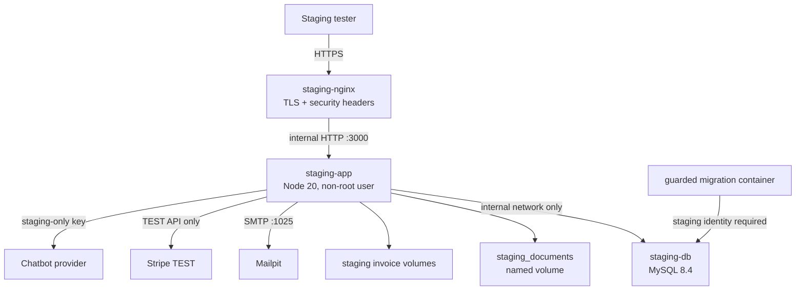

# TASHIRA Staging Environment Report

## Executive status

- Report date: 2026-08-10 (Asia/Dubai).
- Branch: `devops/deployment-safety`.
- Planned hostname: `staging.tashiraev.com`.
- Repository staging foundation: **prepared and statically verified**.
- Running staging environment: **not provisioned**.
- Complete E2E readiness: **blocked**.
- Launch readiness: **55%**.
- Production was not contacted, changed, or used by this phase.

The repository now contains an isolated, production-like Docker staging definition with Node 20, MySQL 8.4, separate document and invoice volumes, Mailpit, Nginx TLS termination, health checks, Docker secrets, a staging-only database guard, Stripe TEST enforcement, and an isolated network topology. It cannot be started or validated end to end on the current workstation because Docker is unavailable and no staging host, DNS control, TLS certificate, or staging credentials were provided.

This report does not claim that a service is running when only its configuration has been prepared.

## Architecture

## Files created or changed

- `staging/docker-compose.yml`
- `staging/Dockerfile`
- `staging/run-app.mjs`
- `staging/guarded-db-push.mjs`
- `staging/nginx.conf.template`
- `staging/.env.example`
- `staging/README.md`
- `.dockerignore`
- `.gitignore`

## Hostnames and TLS

- Recommended hostname retained: `staging.tashiraev.com`.
- Nginx is configured for HTTP-to-HTTPS redirect and TLS 1.2/1.3.
- Certificate files are expected under ignored `staging/certs/` paths.
- The Compose ports default to 8080 and 8443 to avoid accidental conflict with production-like host services. A dedicated staging host may map or reverse-proxy those ports after review.
- DNS and certificates have not been provisioned; therefore there is no live staging URL yet.

## Application runtime

- Build and runtime base: Node 20 slim.
- Build stage runs `npm ci`, TypeScript, ESLint, tests, and build.
- Runtime stage installs production dependencies only.
- Runtime runs as the image's non-root `node` user.
- Application health check uses `/api/health`.
- Docker restart policy supervises the staging application; PM2 is intentionally not nested inside the container.

### PM2 decision

The requested PM2 layer was not added inside Docker. Running PM2 inside a Docker container would create two competing supervisors and reduce signal clarity. If an external staging host must mirror production PM2 exactly, that requires a separate host-level design and staging host access. Docker supervision is the canonical staging design in this foundation.

## Database

### Prepared state

- MySQL image: 8.4.
- Database name is required to be exactly `tashira_staging`.
- Application user is required to be exactly `tashira_staging_app`.
- MySQL has no published host port.
- Credentials are read from ignored Docker secret files.
- The backend network is marked internal.
- A health check gates schema preparation and application startup.
- The migration script constructs its own URL using only the internal `staging-db` hostname.
- The migration guard refuses execution without `STAGING_RUNTIME=true` or with any other database identity.

### Limitation

The repository does not have a complete, ordered migration history matching `db/schema.ts`. For a brand-new disposable staging database, the foundation uses guarded Drizzle `push --force`. This must not be adopted as the production migration strategy. Schema parity with actual production cannot be certified without read-only schema comparison and a reviewed immutable migration baseline.

### Current status

Configured but not created. No database command or migration was executed.

## Storage and uploads

- Documents use the named volume `tashira_staging_documents` mounted at `/staging/storage/documents`.
- Invoice files use two staging-only named volumes.
- An initialization container creates the directories and assigns them to UID/GID 1000 for the non-root application.
- No host production path is mounted.
- No `/var/www/tashira` reference appears in runtime configuration.
- Storage secrets and URL signatures are injected through Docker secrets.
- Existing unit tests pass for path traversal, upload validation, canonical paths, delete behavior, and signed URL tamper/expiry.

Current status: configured but not created or exercised. Upload E2E is blocked.

## Stripe

- Frontend build requires a publishable TEST key.
- Server startup requires a secret key with the TEST prefix and rejects non-TEST keys.
- Existing unit tests pass for TEST-mode enforcement, server amount/currency, idempotent intent creation, and confirmation verification.
- Stripe secret material is expected only in an ignored Docker secret file.

### Blocker

No staging Stripe TEST keys were provided. The repository also lacks an implemented signed Stripe webhook endpoint, so webhook verification cannot be configured or tested yet.

Current status: TEST boundaries prepared; payment E2E unavailable.

## Mail

- Mailpit is provisioned on the internal staging network.
- SMTP names are supplied to the application.
- Mailpit UI is bound to staging-host loopback at port 8025, not exposed publicly by default.

### Blocker

The application currently has no mail transport implementation. UI text claims that confirmation email is sent, but no mail adapter was found. Mailpit cannot receive messages until a reviewed application mail service is implemented.

Current status: sandbox service configured; application integration absent.

## Chatbot

- The staging application requires a dedicated chatbot API key through an ignored Docker secret.
- No production key is reused by configuration.
- Chatbot unit/UI logic remains in the application.

Current status: configured for a staging-only key, but no key or running backend is available. E2E is blocked.

## Environment and secret handling

Public non-secret settings are documented in `staging/.env.example`.

Ignored runtime secret files are required for:

- MySQL root password;
- MySQL application password;
- application secret;
- admin password;
- admin session signing secret;
- storage URL signing secret;
- Stripe TEST secret key;
- chatbot staging key.

`.dockerignore` excludes environment files, staging secrets, certificates, mutable staging data, production reports, storage, uploads, private key/certificate formats, Git metadata, dependencies, and build outputs from the Docker build context.

No secret value is included in the foundation or this report.

## Nginx

- TLS 1.2/1.3 only.
- HTTP redirects to HTTPS.
- Upload limit: 12 MB.
- Explicit proxy timeouts.
- `X-Content-Type-Options`, `Referrer-Policy`, and `X-Frame-Options` headers.
- All traffic proxies only to `staging-app:3000`.
- No storage directory alias or production upstream exists.

Current status: configuration prepared; cannot validate with `nginx -t` until certificates and Docker are available.

## Isolation verification

### Verified statically

- No production IP is present in staging configuration.
- No production database URL is present.
- No production filesystem volume is mounted.
- MySQL is internal and has no host port.
- Database identity and hostname are fixed to staging in guarded code.
- Storage and invoice volumes have staging-only names.
- Stripe startup rejects non-TEST secret keys.
- Mail routes to Mailpit names only.
- Nginx routes only to the staging app service.
- Staging secrets, certificates, and data are gitignored and dockerignored.

### Not yet verified dynamically

- Docker network enforcement on an actual host.
- DNS and TLS certificate ownership.
- Firewall and host route isolation from production.
- Runtime database identity.
- Runtime volume identity and persistence.
- Stripe account/mode.
- Mail capture.
- Backup and restore.
- End-to-end API, upload, chatbot, payment, Admin, and Staff behavior.

## Automated verification completed

- Staging JavaScript entrypoint syntax: pass.
- Staging database guard syntax: pass.
- Drizzle executable path: present.
- Compose YAML parse: pass.
- TypeScript: pass.
- ESLint: pass.
- Tests: 12 files and 35 tests pass.
- Frontend build: pass.
- Server bundle: pass.
- Secret/production-reference scan: no production IP, embedded GitHub token, LIVE Stripe prefix, or hard-coded database URL in staging files.

Docker Compose rendering, image builds, service startup, migrations, and E2E tests were not run because Docker is unavailable locally.

## Backups

- The MySQL and storage volumes are separately named, which permits independent staging backups.
- No backup job is configured yet because no staging host or backup destination exists.
- Staging backup policy and restore test remain blockers before the environment can be called operationally complete.

## Known limitations

1. No staging host or Docker runtime is available.
2. DNS and TLS are absent.
3. Stripe TEST and chatbot staging credentials are absent.
4. Stripe webhook endpoint is absent from application code.
5. Application mail transport is absent.
6. Complete immutable database migrations are absent.
7. PM2 parity is intentionally replaced by Docker supervision.
8. No synthetic seed set covering every business flow exists.
9. No staging backup destination or restore exercise exists.
10. No E2E browser suite exists yet.

## Exact blockers to a running staging environment

1. Provide a dedicated non-production host with Docker Engine and Compose.
2. Point `staging.tashiraev.com` to that host.
3. Provision TLS certificates for the staging hostname.
4. Create new staging-only secret files; never copy production secrets.
5. Provide Stripe TEST publishable, secret, and webhook credentials.
6. Provide a staging-only chatbot key.
7. Implement and review a signed Stripe webhook endpoint.
8. Implement and review a Mailpit-compatible mail transport.
9. Establish a reviewed schema baseline/migration chain.
10. Create synthetic seed data with no customer-derived values.
11. Define staging MySQL/storage backup and restore jobs.
12. Run Compose validation, build, startup, isolation checks, and full E2E on the staging host.

## Functional readiness

| Area | Status |
|---|---|
| Home/static frontend | Previously smoke-tested; pass |
| Application container | Configured, not running |
| MySQL | Configured, not created |
| Storage | Configured, not created |
| Upload | Unit-tested, E2E blocked |
| Chatbot | Key path configured, E2E blocked |
| Stripe payment | TEST guards pass, E2E blocked |
| Stripe webhook | Not implemented |
| Mail | Mailpit configured, app adapter absent |
| Admin/Staff | Unit authorization passes, E2E blocked |
| Nginx/SSL | Configured, not running |
| Backups | Not configured |

## Launch readiness

**55%**

The score increased slightly because an isolated staging architecture and guarded runtime configuration now exist. It remains below launch readiness because the environment is not provisioned and core revenue/data workflows cannot be executed end to end.

## Can complete E2E testing begin?

**No.** Repository preparation is ready for infrastructure review, but complete E2E testing cannot begin until the external host, DNS/TLS, staging-only credentials, missing Stripe webhook/mail capabilities, database baseline, and running services are available.

