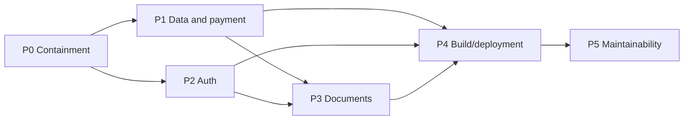

# Stabilization roadmap

No roadmap item is implemented by this document.

## Safe sequence

## P0 — Containment

- Restrict sensitive APIs and production network exposure.
- Replace/disable unsafe browser-only admin access.
- Rotate active embedded credentials after runtime verification.
- Prevent unverified browser payment confirmation.
- Protect application, invoice, chat, and document PII.
- Pause uncontrolled deployment triggers if explicitly approved.

Dependency: establish safe access and production facts without changing data.

## P1 — Data and payment correctness

- Compare production schema to repository.
- Create a canonical migration baseline.
- Reconcile amount/applicant fields.
- Confirm business pricing, VAT, currency, refund, and invoice rules.
- Implement server pricing, Stripe webhooks, idempotency, and transactions.

Dependencies: verified backups, business confirmation, Stripe test environment.

## P2 — Authentication and authorization

- Implement server-side admin/staff identity.
- Use strong password hashing and revocable sessions.
- Add customer ownership, staff permissions, and admin roles.
- Add CSRF protection, throttling, rate limits, and audit logs.

Dependency: authorization matrix and session design approval.

## P3 — Document security

- Verify active filesystem runtime and backups.
- Add authenticated access and safe upload validation.
- Stream files, scan malware, and enforce size limits.
- Repair metadata/file consistency and replacement safety.
- Define retention, restore, deletion, and persistent-volume policy.

Dependencies: P1 identity/schema clarity, P2 access policy, verified backups.

## P4 — Build and deployment

- Add type, lint, test, and build CI gates.
- Consolidate deployment mechanisms.
- Build immutable artifacts and staging promotion.
- Add pinned SSH identity, non-root services, backups, health checks, rollback, and monitoring.

Dependencies: P0–P3 controls and test coverage for critical flows.

## P5 — Maintainability

- Expand unit, integration, security, and end-to-end tests.
- Remove duplicated business logic and undocumented `any`.
- Fix N+1 queries, encoding issues, translations, and documentation drift.
- Add observability, ownership, and operational runbooks.

Dependency: stable architecture and controlled delivery pipeline.
